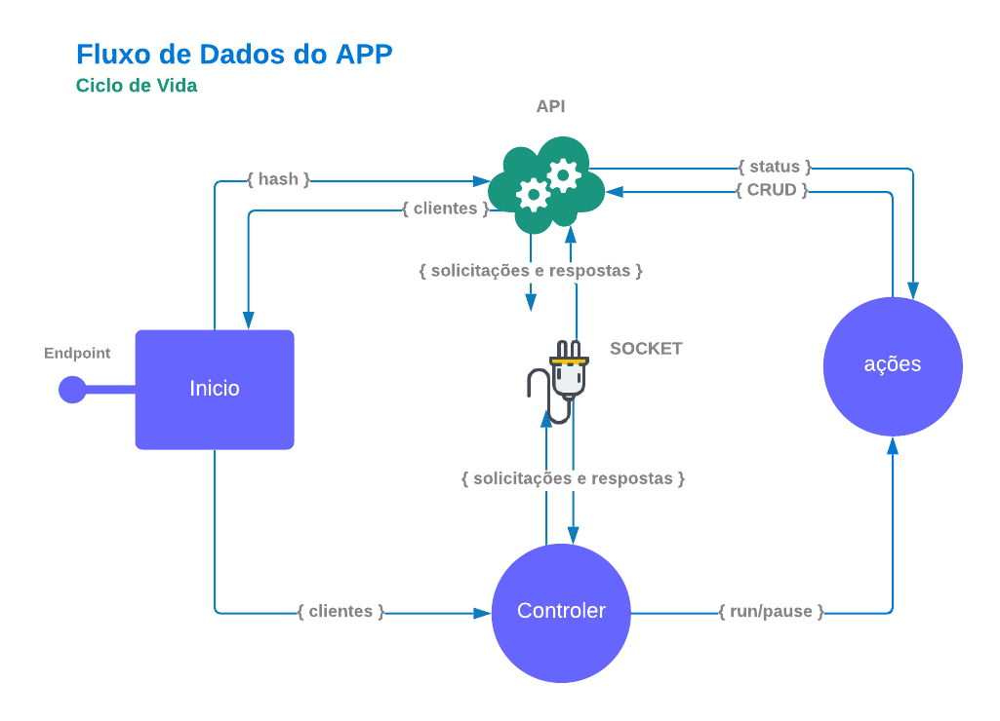
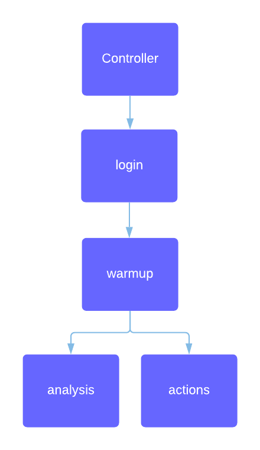

# Sobre

Esta é uma nova versão do [antigo hunter](https://github.com/andrei-coelho/hunt).

Na versão anterior haviam problemas de compatibilidade devido ao uso do programa phantom para realizar automações. O phantom foi descontinuado e com o advento dos frameworks frontend (react, vue, angular) ficou mais dificil manter e atualizar os recursos do APP. 

Nesta nova versão, o hunter faz uso do selenium "sem cabeça" para realizar ações nas redes sociais. Além disso, o APP está muito mais organizado e voltado para o mercado.

# Algoritmo

## Controller
O controller gera os clientes, abre uma conexão websocket registrando cada cliente e armazena seu estado.

## Login
Verifica, gera e salva o cookies da rede social de cada conta de cada cliente. Aqui também analisa se algo deu errado retornando o status de cada conta ao controller.

## warmup
Faz publicações (se houver) nas contas das redes sociais para aquece-las.

## analysis
Utiliza uma conta para fazer análise do perfil principal. Essa conta fica indisponível para realizar ações enquanto a análise é realizada. O módulo de analysis calcula o engajamento das publicações compartilhadas, os seguidores conquistados e os seguidores iniciais. Tudo isso depende de cada rede social.

## actions
Ações nas redes sociais que cada conta de perfil deve realizar respeitando o limite diário configurado.

# Outras Documentações

- [API](https://github.com/andrei-coelho/hunter_api)

- [Modelo ER](https://github.com/andrei-coelho/hunter_api/tree/master/sql)